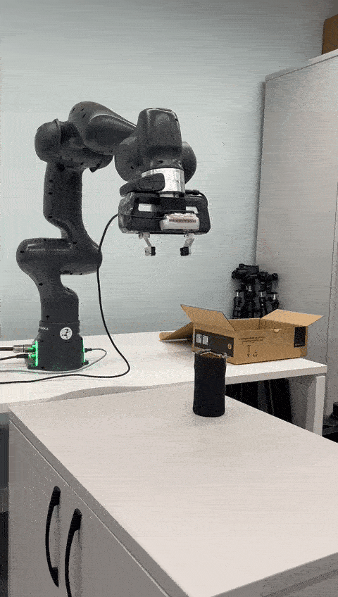

<br>
<br>

**RoboRL Navigator** is a project that offers a codebase for Reinforcement Learning tailored to manipulator robots, particularly the Franka Emika Panda Robot. The project includes both Bullet and ROS Gazebo simulation environments that can be used to train the model to reach a specified pose. It also utilizes an open-source Grasping Pose Detection project that can be tested in either the Gazebo Simulation environment or the Real World.

RoboRL Navigator, already sim-to-real adjustment. Thus, trained models can be tested on
real world.

## Documentation

Documentation is available [here](https://roborl-navigator.readthedocs.io/en/latest/).

## Demo

[](https://www.youtube.com/watch?v=CJJvQztncOw)

## Examples

Production
Tests
Training

### Run Server
```shell
conda activate contact_graspnet_env
python contact_graspnet/contact_graspnet_server.py
```

## Used By

This project is used by the following groups:

- **CUCR** (Cardiff University Coptutational Robotics Team)

## Demonstration



## License

[MIT](https://choosealicense.com/licenses/mit/)


## Credits
```shell
# Paper
# Graspnet
# 

python3 -m pyink --line-length 120 -S .

```